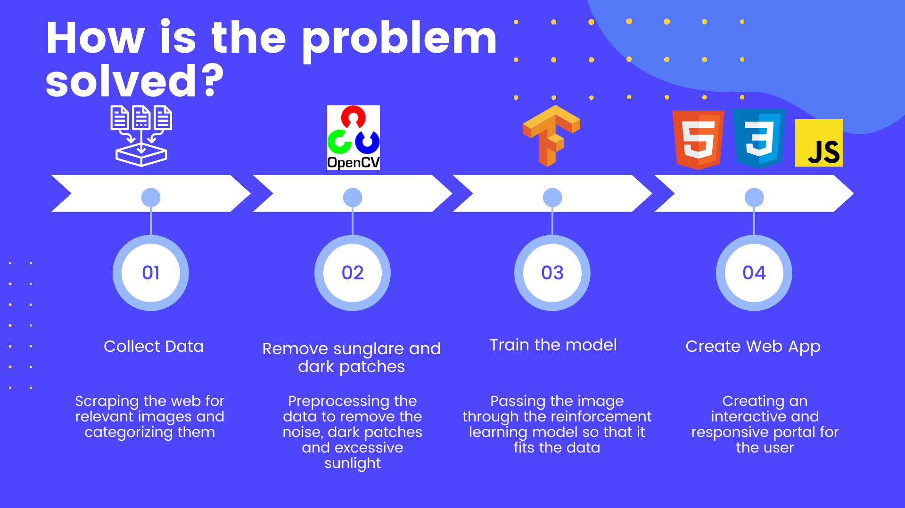

#  Cognition - Octo-Ship
Public Repo For Cognition

#  Titanic 2.0

Project Presented by TEAM : Octo-Ship

# Our Team
Member | Role
------------- | -------------
Arhit Bose Tagore  | Team Lead (ML Developer
Shreyash Mehrotra  |  Web Developer
M V Virajit  |  ML Developer

##  Overview of the Project

>Our application allows the drone user to detect, identify and classify the type of water vessels such as Cruise ship, Military Ship etc. 
>Our algorithm works with the help of Transfer Learning and uses Xception model to identify and classify the type of ships. Our software allows the drones to identify the vessels in the sunlight as well as in absence of light using image processing techniques such dilation and median blur

##  Significance of the Project

* Helps to accurately detect different type of vessels (Cargo, Tankers, Military, Carrier, Cruise)

* Trained the ML model with images of each type of vessel

* User Friendly web application.

## Technology used

* OpenCV
* TensorFlow
* HTML
* CSS
* Javascript
* Flask

## How is the problem solved??

##  Description

* Our application allows the drone user to detect, identify and classify the type of water vessels such as Cruise ship, Military Ship etc. 
* Our algorithm works with the help of Transfer Learning and uses Xception model to identify and classify the type of ships.
* Our software allows the drones to identify the vessels in the sunlight as well as in absence of light using image processing techniques such as dilation and median blur
